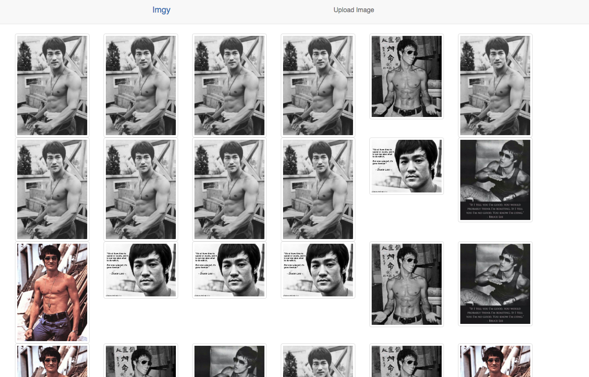
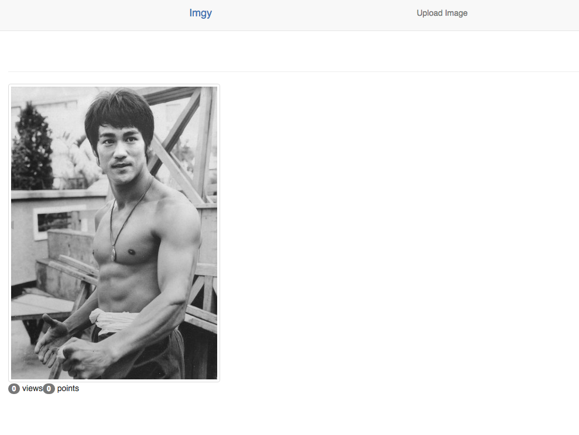
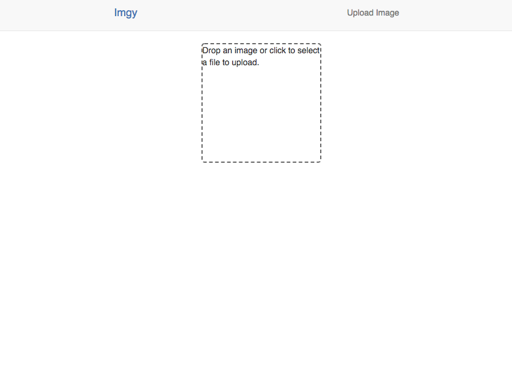

# Imgy Project Frontend

This is a work-in-progress project to create a clone of the Imgur photo sharing site.  This is a React frontend that make calls to the backend REST api in response to user actions.  The RESTful api backend is done in Java and it performs CRUD operations to MySQL tables.  

## RESTful api backend

https://github.com/jeffmt/imgy

## ScreenShots

